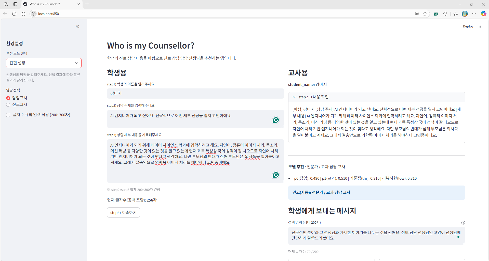

# Who is my Counselor?
학생의 진로 상담 내역 및 진로 이해 여부를 기반으로 진로 상담 선생님을 배정하는 앱입니다.

## 프로젝트 구조
```
├── EDA/                # (준비중) 탐색적 데이터 분석 코드
├── modeling/           # (준비중) 모델 학습 및 평가 코드
├── prototype/          # 프로토타입 애플리케이션
│   ├── app/            # 애플리케이션 진입점 및 실행 관리
│   │   └── __init__.py
│   ├── core/           # 핵심 로직
│   │   └── __init__.py
│   ├── infra/          # 인프라/환경 설정
│   │   └── __init__.py
│   └── ui/             # 사용자 인터페이스
│       └── __init__.py
├── etc/                # readme 작성에 사용된 이미지 모음
└── readme.md           # 프로젝트 소개 문서

```

## 프로토타입 작동 영상

- [ver.0 작동 영상 확인하기.](https://youtu.be/SUAoHR83eFk)

## 관련 문서
- [프로토타입 앱 작동 설명서](prototype/app_readme.md)
